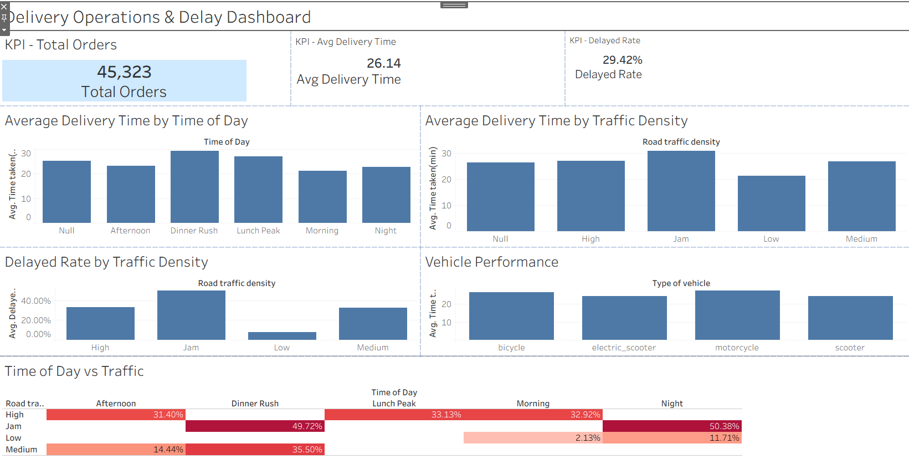

# Food Delivery Operations & Delay Analysis

## Project Overview

This project analyzes food delivery operations to identify factors associated with longer delivery times and delayed orders.

The analysis uses Python for data cleaning, preprocessing, feature engineering, and exploratory analysis, and Tableau for interactive dashboard development.

The main focus is on understanding how delivery performance varies across traffic conditions, time of day, and vehicle types.

---

## Business Problem

Food delivery operations have experienced increasing delivery times and customer complaints. The objective of this project is to analyze delivery data and identify operational patterns associated with longer delivery times and delayed orders.

The analysis focuses on three main areas:

* Kitchen preparation time
* Traffic and delivery conditions
* Peak-hour delivery performance

The results are presented through an interactive Tableau dashboard to support operational decision-making.

---

## Project Objectives

The main objectives of the project are:

* Clean and prepare the raw food delivery dataset.
* Handle missing, invalid, and inconsistent values.
* Identify and remove extreme delivery-time outliers.
* Create useful features for operational analysis.
* Analyze delivery performance by time of day.
* Analyze the relationship between traffic density and delivery delays.
* Compare delivery performance across vehicle types.
* Build an interactive Tableau dashboard.
* Communicate key operational insights through visualizations.

---

## Dataset

The project uses a food delivery dataset containing order, delivery, traffic, weather, vehicle, and location information.

The original dataset contains **45,593 records** and **20 columns**.

Important variables include:

* `Delivery_person_ID`
* `Delivery_person_Age`
* `Delivery_person_Ratings`
* `Order_Date`
* `Time_Orderd`
* `Time_Order_picked`
* `Weatherconditions`
* `Road_traffic_density`
* `Vehicle_condition`
* `Type_of_order`
* `Type_of_vehicle`
* `multiple_deliveries`
* `Festival`
* `City`
* `Time_taken(min)`

---

## Tools & Technologies

* Python
* Pandas
* NumPy
* Jupyter Notebook
* Tableau
* Tableau Public
* GitHub

---

## Data Cleaning & Preparation

The raw food delivery dataset was cleaned using Python and Pandas.

The main preparation steps included:

### Missing Values

Textual missing values such as `"NaN"` were standardized and converted into proper missing values.

Numeric columns were converted to appropriate numeric data types.

### Date and Time Cleaning

The following columns were converted into datetime format:

* `Order_Date`
* `Time_Orderd`
* `Time_Order_picked`

### Data Consistency

Inconsistent text values were cleaned using whitespace removal.

The city value `Metropolitian` was corrected to `Metropolitan`.

### Ratings Validation

Ratings outside the expected 1–5 scale were treated as invalid and converted to missing values.

### Outlier Removal

Extreme delivery times were identified using the IQR method.

For `Time_taken(min)`:

* Q1 = 19 minutes
* Q3 = 32 minutes
* IQR = 13 minutes
* Upper bound = 51.5 minutes

Records above the upper bound were removed.

After cleaning and outlier removal, the dataset contained **45,323 records**.

---

## Feature Engineering

Several features were created to support the analysis.

### Preparation Time

Preparation time was calculated as the difference between:

`Time_Order_picked - Time_Orderd`

Midnight crossover cases were adjusted by adding 24 hours where necessary.

The resulting preparation time ranged from approximately **5 to 15 minutes**.

### Order Hour

The hour of the order was extracted from `Time_Orderd`.

### Time of Day

Orders were categorized into the following time periods:

| Time        | Category    |
| ----------- | ----------- |
| 08:00–11:59 | Morning     |
| 12:00–14:59 | Lunch Peak  |
| 15:00–16:59 | Afternoon   |
| 17:00–21:59 | Dinner Rush |
| 22:00–23:59 | Night       |

### Delayed Orders

For this project, an order was classified as delayed when:

`Time_taken(min) > 30`

This threshold is a **project assumption** because the dataset does not provide an official delay threshold.

---

## Assumptions & Methodology

Some project metrics require assumptions because the dataset does not contain a delivery timestamp.

### Delivery Time

`Time_taken(min)` was used as the available delivery-duration measure.

### Transit Time

A separate transit-time calculation was not used because the dataset does not provide a delivery timestamp that would allow transit duration to be calculated reliably.

### Delay Definition

Orders with `Time_taken(min) > 30` were classified as delayed.

These assumptions are documented to keep the analysis transparent and reproducible.

---

## Key Insights

### 1. Traffic Density and Delays

The delayed rate by traffic density was:

* **Jam:** 49.78%
* **High:** 33.20%
* **Medium:** 32.47%
* **Low:** 7.87%

The dataset therefore shows substantially higher delayed-order rates under heavier traffic conditions.

### 2. Peak-Hour Bottleneck

Dinner Rush combined with Jam traffic represents an important operational hotspot because it combines high order volume with a high delayed rate.

The average delivery time for this combination was approximately **30.77 minutes**, with a delayed rate of approximately **49.72%**.

### 3. Vehicle Performance

Average delivery times varied by vehicle type:

* Motorcycle: 27.35 minutes
* Bicycle: 26.43 minutes
* Scooter: 24.48 minutes
* Electric Scooter: 24.46 minutes

These results describe differences in the dataset but do not establish that vehicle type itself causes delays.

### 4. Overall Delivery Performance

After cleaning and outlier removal:

* **Total orders:** 45,323
* **Average delivery time:** approximately 26 minutes
* **Delayed rate:** 29.42%

---

## Tableau Dashboard

The Tableau dashboard provides an interactive overview of delivery operations.

The dashboard includes:

1. Average Delivery Time by Time of Day
2. Average Delivery Time by Traffic Density
3. Delayed Rate by Traffic Density
4. Vehicle Performance
5. Time of Day vs Traffic

### Dashboard Screenshot



### Tableau Public

> Tableau Public link will be added here.

---

## Project Structure

```text
food-delivery-analysis/
│
├── README.md
├── food_delivery_analysis.ipynb
├── train.csv
├── delivery_cleaned.csv
├── delivery_dashboard.png
├── Food Delivery.pdf
├── food delivery tableau.twbx
└── ~food delivery tableau__9240.twbr
```

---

## How to Run the Project

### 1. Clone the Repository

Download or clone this repository from GitHub.

### 2. Install Required Libraries

```bash
pip install pandas numpy jupyter
```

### 3. Open the Notebook

Open:

```text
food_delivery_analysis.ipynb
```

using Jupyter Notebook or JupyterLab.

### 4. Run the Analysis

Run the notebook cells in order to reproduce the data cleaning, feature engineering, and analysis.

### 5. Open the Clean Dataset

The cleaned dataset is available as:

```text
delivery_cleaned.csv
```

---

## Limitations

This analysis has several limitations:

* The dataset does not contain a delivery timestamp.
* Therefore, a reliable transit-time calculation cannot be performed.
* The 30-minute delay threshold is a project assumption rather than an official business threshold.
* The analysis identifies associations and patterns but does not establish causation.
* Missing values remain in some fields where reliable imputation was not appropriate.
* The analysis is based on the available dataset and may not represent all delivery operations.

---

## Conclusion

The analysis highlights traffic conditions and peak delivery periods as important areas for operational investigation.

In particular, Jam traffic and the Dinner Rush period are associated with higher delivery times and delayed-order rates. The Tableau dashboard provides a visual summary of these patterns and can be used as a starting point for further operational analysis.

---

## Author

**Food Delivery Operations & Delay Analysis**

Python • Pandas • NumPy • Tableau • GitHub
